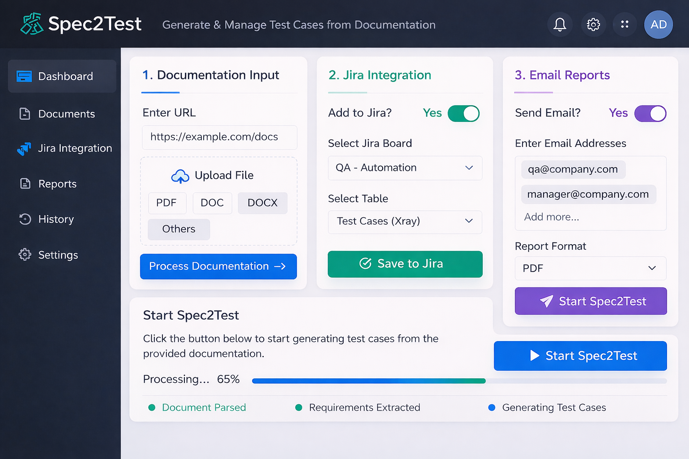

# Spec2Test

A minimal Python project (sample starter) containing a small `main.py` demo script.

## Table of Contents

- [What this project is](#what-this-project-is)
- [Files](#files)
- [Requirements](#requirements)
- [Run / Quick Start](#run--quick-start)
- [Secrets & API keys](#secrets--api-keys)
- [Design & Architecture](#design--architecture)
  - [High-Level Architecture](#high-level-architecture)
  - [Technology Stack](#technology-stack)
  - [Pipeline Detailed Flow](#pipeline-detailed-flow)
  - [Agent Workflow & Orchestration](#agent-workflow--orchestration)
  - [Folder Structure & Examples](#folder-structure--examples)
  - [Advanced Features & Next Steps](#advanced-features--next-steps)
- [Notes & next steps](#notes--next-steps)
- [Contact](#contact)

## What this project is

You’re basically describing an AI agent that reads documentation → understands the UI flow → logs into the app → performs automated UI 
testing. This is a very good use case for an LLM + RAG + Browser automation agent architecture.
## Files

- `main.py` — sample Python script that defines `print_hi(name)` and runs it when executed as a script.

## Requirements

- Python 3.8+ (tested on macOS with the system Python or a virtual environment)

## Run / Quick Start

- Quick local run (demo):

```bash
python3 main.py
```

- Full end-to-end pipeline (ingest → embed → LLM test planner → executor → Allure results)

This repository includes a single orchestrator entrypoint `main.py` that now wires the full flow. The commands below show common ways to run the pipeline from the repo root. These examples assume you have a working Python 3.8+ environment and that optional tools (Playwright, Allure CLI) are installed when used.

1) Generate embeddings + a test plan (no executor):

```bash
python3 main.py --save out_embeddings.json --generate-tests --tests-out generated_test_plan.json
```

2) Run the full pipeline including the Playwright executor (real headless run). System-level steps are skipped for safety by default:

```bash
python3 main.py --save out_embeddings.json --generate-tests --tests-out generated_test_plan.json \
  --run-executor --executor-out reports/generated_test_plan_report.json --allure-generate
```

3) Run the executor in simulate-only mode (safe, no browser launched):

```bash
python3 main.py --generate-tests --run-executor --simulate-executor --executor-out reports/generated_test_plan_report.json --allure-generate
```

4) Watch `docs/` for changes and run the full pipeline automatically (safe default: simulate executor).

```bash
python3 scripts/watch_and_run.py
# To allow real executor runs when changes are detected (use with care):
REAL=1 python3 scripts/watch_and_run.py
```

Allure report generation and viewing

- The `--allure-generate` flag will create `allure-results/` (JSON + attachments). To render and view the HTML report you need the Allure CLI installed (Homebrew or downloaded binary):

macOS (Homebrew):

```bash
brew install allure
# generate + open the report
allure generate allure-results -o allure-report --clean
allure open allure-report
```

If you used `--allure-generate` with `main.py`, the converter already created `allure-results/`; the commands above generate the HTML under `allure-report/` and open a local web server.

Useful helper scripts

- `pipeline/agents/executor/auto_resolve_selectors.py` — try to resolve DESCRIBE_TARGET placeholders by probing the live DOM (safe, non-destructive).
- `pipeline/agents/executor/run_playwright_executor.py` — runs a JSON plan via the Playwright runner (supports `--simulate` to avoid launching a browser).
- `pipeline/agents/executor/generate_allure_results.py` — convert executor report JSON into Allure result files.
- `pipeline/agents/executor/run_postprocess.py` — runs selector suggester, generates Playwright script, and summarizes reports.
- `scripts/watch_and_run.py` — lightweight file watcher that triggers the pipeline when `docs/` change.

Dependencies (quick)

These are the main packages you may want to install locally for the full experience:

```bash
python3 -m pip install -r requirements.txt
# If you plan to run Playwright flows locally:
python3 -m pip install playwright
python3 -m playwright install chromium
# For Allure generation (macOS Homebrew recommended):
brew install allure
```

If you don't have a `requirements.txt`, ensure you at least have:
- openai
- python-dotenv (optional, to load `.env`)
- playwright (for browser runs)
- pydantic
- pytest (optional for tests)

Security note

- Do NOT commit secrets or API keys. Use a local `.env` file or environment variables to provide `OPENAI_API_KEY` and other sensitive values. See the "Secrets & API keys" section below for more details.

Troubleshooting & tips

- If Playwright times out waiting for a selector:
  - Open `reports/screenshots/` (executions save screenshots on failure) and inspect the DOM to derive a better selector.
  - Use `pipeline/agents/executor/auto_resolve_selectors.py` to attempt automatic selector discovery, then review the generated script `generated_playwright_test_resolved.py`.

- If the LLM produces placeholders like `DESCRIBE_TARGET`, either:
  - Run auto-resolve to attempt heuristic selector discovery, or
  - Update the generated Playwright script manually with robust selectors (IDs, stable classes, or text/href checks).

- Allure CLI not found via `npx`? Install it with Homebrew or download the binary (Homebrew recommended on macOS). See `reports/README_ALLURE.md` for alternatives.


## Secrets & API keys

Important: do NOT commit API keys or other secrets into the repository. If you accidentally shared an API key (for example, in a chat or a commit), revoke it immediately with the provider and generate a new one.

This repository includes an `.env.example` to show the expected environment variables and a `.gitignore` entry to keep your local `.env` out of version control.

Quick steps to use an OpenAI API key locally (zsh):

1. Create a `.env` file at the project root (do not commit it):

```bash
# .env (local, NEVER commit)
OPENAI_API_KEY=sk-your-new-key-here
```

2. Add `.env` to `.gitignore` (already added to this repo).

3. Temporarily set the key in your shell for the current session:

```bash
export OPENAI_API_KEY="sk-your-new-key-here"
```

4. In Python, read the key from the environment:

```python
import os
OPENAI_API_KEY = os.getenv("OPENAI_API_KEY")
```

5. Optional: to load `.env` automatically during development, install `python-dotenv` and add:

```python
from dotenv import load_dotenv
load_dotenv()  # loads variables from .env into environment
```

Security actions you should take now

- You pasted an OpenAI API key into this chat. That key is exposed and should be revoked immediately from your OpenAI dashboard (Account → API Keys) and replaced with a new key.
- After replacing it, store the new key only in your local environment (e.g., `.env` or your shell profile) and never paste it in public chat or commit it.

Commands to help you rotate/unset the key locally (zsh):

```bash
# Unset in current shell
unset OPENAI_API_KEY
# Remove any accidental occurrences from your shell profile (~/.zshrc)
# (Open the file in your editor and delete the export line)
``` 

If you'd like, I can help you rotate the key name and update any code that currently reads hard-coded keys; however, I will not insert or store your actual key in the repository.

## Design & Architecture

Below is the project-level design information you pasted into the README (reorganized here). It describes a production-style pipeline for building an AI-driven UI testing system that reads documentation, generates test cases, executes them in a browser, and validates the UI using an LLM.

### High-Level Architecture


High-level flow (summary):

- Document ingestion (chunk + embed)
- Vector database for embeddings
- LLM-based test planner that extracts UI flows and generates test steps
- Agent controller that converts test steps to browser automation calls
- Browser automation (Playwright / Selenium)
- UI state analysis (DOM + screenshot + LLM)
- Test reporting

Diagram (conceptual):

                ┌─────────────────────────┐
                │   Application Docs      │
                │ (PDF, Confluence, MD)   │
                └──────────┬──────────────┘
                           │
                           ▼
                ┌─────────────────────────┐
                │ Document Ingestion      │
                │ Chunk + Embed           │
                └──────────┬──────────────┘
                           │
                           ▼
                ┌─────────────────────────┐
                │   Vector Database       │
                │ (Stores embeddings)     │
                └──────────┬──────────────┘
                           │
                           ▼
               ┌──────────────────────────┐
               │   LLM Test Planner       │
               │ Extract UI flows         │
               │ Generate test steps      │
               └──────────┬───────────────┘
                          │
                          ▼
               ┌──────────────────────────┐
               │   Agent Controller       │
               │ Tool calling             │
               │ Decision making          │
               └──────────┬───────────────┘
                          │
                          ▼
            ┌───────────────────────────────┐
            │ Browser Automation Tool       │
            │ (Playwright / Selenium)       │
            └──────────┬────────────────────┘
                       │
                       ▼
            ┌───────────────────────────────┐
            │ UI State Analyzer             │
            │ DOM + Screenshot + LLM        │
            └──────────┬────────────────────┘
                       │
                       ▼
            ┌───────────────────────────────┐
            │ Test Report Generator         │
            │ Pass/Fail + Logs              │
            └───────────────────────────────┘

### Technology Stack (Recommended)

LLM:
GPT-4o / GPT-5 class for heavy reasoning about UI flows.

Frameworks and libraries

- LangChain — LLM pipeline helpers
- LlamaIndex — document RAG
- LangGraph — agent orchestration
- Playwright — browser automation
- Chroma / Pinecone — vector DB

Recommendation: start with Chroma + LangChain (or LlamaIndex) + Playwright, iterate to Pinecone in production.

### Pipeline Detailed Flow

1. Document Ingestion
   - Input: product documentation, Confluence pages, Swagger, UI flow documentation.
   - Process: chunk → embed → store in vector DB.
   - Tools: LlamaIndex, LangChain loaders.

2. Test Case Generator (LLM)
   - The LLM reads documentation and produces structured test cases (JSON with steps).
   - Example output format:
     {
       "test_name": "",
       "steps": [ {"action":"click","target":"login button"}, ... ]
     }

3. Agent Controller
   - Interprets the JSON steps and calls the browser automation tool.
   - Converts high-level actions into Playwright commands.

4. Browser Automation Execution
   - Use Playwright to open a browser, run steps, take screenshots, and capture DOM.
   - Example (generated) Playwright snippet provided in the original paste.

5. UI Verification
   - DOM verification (locator checks) and vision verification (screenshot + LLM verification).
   - Optionally use LLM to analyze screenshots and confirm expected UI elements.

6. Feedback Loop / Self-healing
   - When selectors fail, capture DOM and ask LLM to suggest alternative selectors.
   - Retry with suggested selector(s).

7. Reporting
   - Generate pass/fail reports with logs and screenshots (Allure recommended).
   - Push notifications (Slack) or CI artifacts.

### Agent Workflow & Orchestration

You can split the system into agents:

- Doc Agent: ingestion and retrieval
- Test Generator Agent: create structured test JSON
- Execution Agent: runs tests in Playwright
- UI Validation Agent: analyzes screenshots + DOM with LLM
- Report Agent: aggregates and publishes results

Agent frameworks: LangGraph, AutoGen

Example small workflow graph:

DOC INGEST → RAG RETRIEVAL → TEST GENERATOR → EXECUTION → VALIDATION → REPORT

### Folder Structure (Example)

Example project layout for this system (suggested):

ai-ui-testing-agent/

- README.md
- requirements.txt
- dockerfile
- configs/
  - llm_config.yaml
  - test_config.yaml
- docs/                 # Project documentation and generated ingestion artifacts
  - WebGoat 5 Deployment Guide v0.1.pdf  # Source PDF used for ingestion (original manual; may be scanned or selectable)
  - webgoat_chunks.json  # (optional) Chunked text output produced by `run_chunker.py` for inspection or reuse
  - webgoat_embeddings.json  # Saved chunks+embeddings produced by `run_embedder.py` (dummy/OpenAI); used for persistence or retrieval
  - webgoat_embeddings_token.json  # Token-aware chunking + embeddings (if token chunking was used); includes token-based chunk boundaries
  - .gitkeep  # placeholder to keep the `docs/` directory in version control
- pipeline/
  - ingestion/
    - doc_loader.py          # Loads documents from `docs/` (PDF, .md, .txt). Uses PyPDF2 for selectable text and falls back to OCR (PyMuPDF/pytesseract or pdf2image) when needed. Public API: load_documents(dir_path) -> list[dict]{path,text,type}.
    - chunker.py            # Text chunking utilities. Provides `chunk_text` (character-based) and `chunk_text_by_tokens` (token-aware using tiktoken, with overlap). Falls back to char-based heuristic if tiktoken is not available.
    - embedder.py           # Embedding interface. Provides `embed_chunks(chunks, backend=...)` with backends: `dummy` (length-based), `openai` (real embeddings, batching & retries), and `auto` (use OpenAI if API key present, else dummy).
    - run_chunker.py        # CLI helper: locate WebGoat doc, chunk it (char or token mode), preview chunks and optionally save chunks JSON for downstream embedding.
    - run_embedder.py       # CLI helper: chunk (char or token) + embed chunks using chosen backend (dummy/openai/auto). Supports --model and --batch-size, and can save chunks+embeddings to JSON.
    - check_webgoat.py      # Small verification script that ensures the WebGoat PDF is discoverable under `docs/` and that text is extractable (prints preview and status codes).
    - store_and_query_chroma.py  # Store precomputed (or freshly computed) chunks+embeddings into a local Chroma DB and run a sample semantic query. Includes helpful diagnostics and supports token chunking and OpenAI batching.
  - rag/
    - langchain_rag.py    # Optional LangChain-based RAG helper (wraps Chroma + LangChain RetrievalQA)
    - qa.py               # QA helper: high-level answer_query(...) which uses SimpleRetriever and optionally OpenAI to synthesize answers
    - retriever.py        # SimpleRetriever: loads precomputed chunks+embeddings JSON and returns top-k results by cosine similarity
    - run_qa.py           # CLI wrapper to run QA against saved embeddings (uses qa.answer_query)
    - run_test_generator.py  # CLI wrapper to generate a structured test plan from retrieved context (uses test_generator.generate_test_plan)
    - test_generator.py   # Test Generator: uses retrieval + LLM to output structured JSON test plans (schema-based)
  - agents/
    - test_generator/
      - generator_agent.py
      - prompts.py
    - executor/
      - playwright_runner.py
      - step_executor.py
    - validator/
      - screenshot_validator.py
      - dom_validator.py
    - orchestrator/
      - workflow_graph.py
- browser/
  - login_handler.py
  - session_manager.py
- tests/
- reports/
- scripts/
  - run_pipeline.py

### Example Code Skeleton & Snippets

(From the pasted content — trimmed and reorganized here as examples.)

- Document ingestion using LlamaIndex or LangChain loaders.
- Test generator uses a conversational LLM prompt to produce JSON test steps.
- Playwright executor converts steps into browser actions (navigate, fill, click, verify).
- Screenshot validator sends images and expected results to an LLM to get PASS/FAIL explanations.

### Recommended Tools & Files (Examples from the paste)

requirements.txt (example):

- langchain
- langgraph
- llama-index
- openai
- playwright
- chromadb
- pydantic
- fastapi
- uvicorn
- pytest
- allure-pytest

### Advanced Features & Next Steps

1. Self-healing selectors — use LLM to pick robust selectors when tests fail.
2. UI change detection — compare screenshots to detect visual regressions.
3. Test generation from Figma/design specs.
4. Synthetic test data generation via LLM.
5. Vision-based testing (LLM analyzes screenshots rather than DOM selectors).
6. CI integration: GitHub Actions + Docker to run tests and publish Allure reports.

## Notes & next steps

- This repository is a starting point — replace `main.py` with your own code or add modules and tests.
- Consider adding a `requirements.txt` if you add third-party dependencies.
- Add a proper license and project description as the project matures.

## Contact

If you want help expanding this project, describe what you'd like to add (CLI, tests, packaging, etc.).

## Next steps & Roadmap

The following outlines practical, high-value next steps you can take to evolve this project into a production-capable workflow: (1) add a user-facing dashboard to upload documentation and configure downstream actions (Jira + email), and (2) begin developing your own LLM / model stack (instead of relying on the OpenAI API).

Each item below is actionable and ordered so you can make incremental progress and verify results quickly.

---

### 1) Integrate a UI / Dashboard (quick prototype → production)

Goal: provide a simple web UI so non-technical users can upload documentation (URL, PDF, DOCX, text), choose whether to create test cases in Jira, and decide whether to email the reports.

High-level UX flow (dashboard):
- Section: "Upload / Source"
  - Options: Upload PDF / Upload DOCX / Paste URL / Attach text
  - Validate file type, display a short preview (first 1–2 chunks)
- Section: "Test Plan Options"
  - Toggle: Generate test cases (on/off)
  - Max steps, planner model selection (dropdown)
- Section: "Jira Integration" (optional)
  - Toggle: Create test cases in Jira (yes/no)
  - If yes: ask for Jira host (URL), authentication method (API token or OAuth), Project key, Issue type to use (test case/case type), and a mapping UI for fields (title, description, steps)
  - Provide an on-screen button "Test connection" that validates credentials
- Section: "Email Reports" (optional)
  - Toggle: Email report after run (yes/no)
  - If yes: enter comma-separated email addresses, choose report format (Allure HTML link, zipped attachments, PDF)
- Section: "Run / Schedule"
  - Button: Run Now (immediate pipeline run)
  - Option: Schedule (cron-like or one-time)
  - Display: live status / logs (link to Allure report when ready)

Technology options (quick prototyping → production):
- Fast prototype (minutes): Streamlit or Gradio
  - Pros: very fast to build UIs, file uploads, and simple form controls
  - Example quick start (Streamlit):

```bash
python3 -m pip install streamlit
# run streamlit app (you'll create an `app.py` to accept uploads and call `main.py` programmatically)
streamlit run app.py
```

- Production / Flexible: FastAPI (backend) + React / Vue / Svelte (frontend)
  - FastAPI endpoints:
    - POST /api/upload (accept files or URLs)
    - POST /api/run (parameters: run-executor, simulate, Jira config, email list)
    - GET /api/status/<job_id>
    - WebSocket for live logs
  - Queue and worker: RQ, Celery, or Dramatiq to run pipeline jobs asynchronously and reliably
  - Storage: persist uploaded files and generated artifacts under a secure storage directory (or S3)

Backend job flow:
1. User uploads doc and clicks Run Now
2. Backend enqueues a job (Queue) with the input + config
3. Worker performs the pipeline (calls `main.py` entrypoints programmatically or imports pipeline functions) and writes artifacts to `reports/` + `allure-results/`
4. When finished, the backend updates job status and optionally (a) creates Jira issues, (b) sends email with report links/attachments

Jira integration (practical):
- Use Jira Cloud REST API (or Jira Server REST API) with an API token or OAuth.
- Required steps:
  1. Create API token / OAuth app in Jira
  2. On the dashboard collect `JIRA_HOST`, `JIRA_USER_EMAIL`, `JIRA_API_TOKEN`
  3. Implement a small mapping layer: test_name -> summary, description -> detailed steps serialized (or attach a file), each step becomes a test case issue or a single issue with subtasks depending on your Jira workflow
  4. Use `requests` or `jira` Python client to create issues.

Example (very small illustrative snippet):

```python
import requests
url = f"https://{JIRA_HOST}/rest/api/2/issue"
headers = {"Content-Type": "application/json"}
auth = (JIRA_USER_EMAIL, JIRA_API_TOKEN)
payload = {
  "fields": {
    "project": {"key": "PROJ"},
    "summary": "Test: Validate WebGoat deployment",
    "issuetype": {"name": "Test"},
    "description": "Auto-generated test plan..."
  }
}
requests.post(url, json=payload, auth=auth, headers=headers)
```

Emailing reports
- Use SMTP (company mail) or a transactional provider (SendGrid, Mailgun, SES).
- Collect SMTP host, port, user, password or API key via the dashboard and store securely (see Security section below).
- Optionally attach a zipped `allure-report/` or provide a short Allure-hosted link.

Security & secrets
- Never persist secrets in plain text within the repo.
- Recommended: store secrets in environment variables or a vault (HashiCorp Vault, AWS Secrets Manager). For local/development, store in `.env` (gitignored).
- For Jira, prefer OAuth where possible; otherwise use API tokens and minimal-scope accounts.

Deliverables for UI integration (minimal MVP list)
- Streamlit `app.py` that uploads docs and triggers pipeline
- FastAPI worker endpoints + RQ/Celery worker adapter to run pipeline jobs
- Jira connector module with small tests to validate connectivity
- Email sender adapter that can attach zip or HTML report

---


### 2) Develop your own LLM (roadmap and practical starting points)

Important note: building or running your own LLM (from scratch or fine-tuning large open-source models) is a significant undertaking. There are multiple approaches — choose one based on your budget, latency/throughput needs, and expertise.

High-level options (recommended order):

A. Retrieval-Augmented Generation (RAG) with a small local model
- Run a smaller open-source model locally (Llama 2, Mistral, Falcon variants) and combine with retrieval from your embeddings (this brings most gains with far lower infra cost).
- Pros: cheaper, faster to prototype, excellent for doc-driven test generation.
- Tools: Haystack, LangChain, Llama.cpp/ggml for local CPU inference, vLLM or text-generation-inference for GPU serving.

B. Fine-tune an open-source base model with your domain data (LoRA / PEFT)
- Use Hugging Face transformers + PEFT/LoRA to fine-tune a base model (e.g., Llama 2, Mistral) on a curated dataset of docs ↔ desired plan format pairs.
- Pros: keeps model size manageable and enables domain specialization. Requires modest GPU resources for LoRA-based tuning.
- Typical pipeline:
  1. Prepare dataset (input: docs/context, instruction: 'generate JSON test plan', target: JSON plan)
  2. Use `peft` + `transformers` or `trlx` or `accelerate` to fine-tune using LoRA
  3. Validate & iterate

Example minimal commands (development):

```bash
python3 -m pip install transformers accelerate peft safetensors datasets
# Convert data into HF Dataset and fine-tune with LoRA (high-level)
# See PEFT docs and tutorials; exact commands depend on model and tooling
```

C. Training a model from scratch
- Not recommended unless you have large-scale compute and data. Training from scratch requires massive datasets and distributed GPU clusters.

Serving & inference
- Lightweight local inference: `llama.cpp` / `ggml` for CPU or small GPU on local machines
- Production GPU inference: `vLLM`, `text-generation-inference` (Hugging Face), or a managed inference cluster

Evaluation & safety
- Create an evaluation suite (unit tests for generation quality):
  - Validate JSON schema produced by the model
  - Run test plans in a sandbox and evaluate pass/fail rate
- Add guardrails, sanitization, and allowed-action lists to prevent unsafe outputs (e.g., system commands).

Data collection & annotation
- Collect a high-quality dataset of docs → gold test-plans. You can seed with the LLM-generated plans and then correct them (human-in-the-loop) to create a supervised dataset for fine-tuning.

Cost & infra considerations
- LoRA fine-tuning is inexpensive versus full fine-tuning and is a good starting point.
- Hosting a reliably fast large model requires GPUs (A10/NVIDIA A100 for production). For prototyping you can run small models locally or on a single GPU.

Quick prototyping path (practical)
1. Start with RAG + a small local model (e.g., Llama 2 small or other 7B): integrate retrieval + LLM inference to generate plans.
2. Create a gold dataset from several dozen good plan examples (collect and correct LLM output).
3. Do a LoRA-based fine-tune of the base model using that dataset.
4. Serve via `text-generation-inference` or `vLLM` behind a FastAPI endpoint consumed by your pipeline.

Example tools & libraries
- transformers, peft, accelerate, datasets (fine-tuning)
- vLLM or text-generation-inference (high-performance serving)
- llama.cpp / ggml (local CPU experiments)
- huggingface hub (model artifacts, safetensors)

Example commands (install prototyping deps):

```bash
python3 -m pip install transformers accelerate peft safetensors datasets vllm
# small example: run a Hugging Face transformer's pipeline locally
python -c "from transformers import pipeline; print(pipeline('text-generation', model='meta-llama/Llama-2-7b-chat-hf')( 'Hello', max_new_tokens=10))"
```

Legal & licensing
- Verify model license (e.g., Llama 2 has specific license terms). Ensure you comply with licensing for any base model you use.

---

## Quick decision checklist (actionable next steps)
- [ ] Implement a Streamlit MVP that accepts a document and a "Run" button to invoke the pipeline (safe default: simulate executor).
- [ ] Add a backend worker (RQ/Celery) so the UI doesn’t block while the pipeline runs and can persist job results.
- [ ] Implement a Jira connector module to map generated plans to Jira Test issues and validate connection from the dashboard.
- [ ] Implement an email sender adapter (SMTP/SendGrid) to distribute reports automatically.
- [ ] Start with RAG + a small open-source model; curate a 50–200 example dataset and do a LoRA fine-tune.
- [ ] Build a small evaluation harness that validates the model output schema and executes the generated plan in simulate mode.

If you want, I can start implementing the Streamlit MVP (front-end + FastAPI backend wiring) and the Jira/email adapters next — tell me if you prefer the interactive approval flow first (A2) or the Streamlit MVP.
